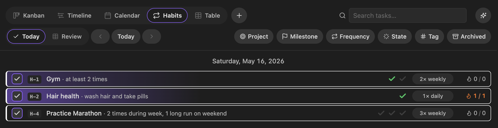
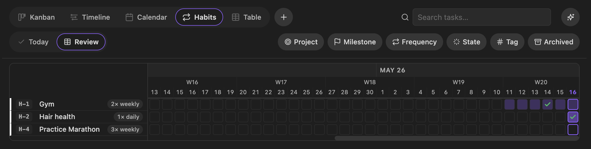

# Changelog

All notable changes to Marvis are documented in this file.

The format is based on [Keep a Changelog](https://keepachangelog.com/en/1.1.0/),
and this project adheres to [Semantic Versioning](https://semver.org/spec/v2.0.0.html).
Releases prior to 0.2.0 are not catalogued here — see the [GitHub releases page](https://github.com/Mahdi-Massahi/marvis/releases) for older notes.

## [Unreleased]

## [0.2.2] — 2026-05-16

### Fixed

- Archived events were rendering in the Calendar and Timeline views. They now respect the existing `Include archived` filter toggle (same behaviour as archived tasks/habits) — hidden by default, visible when the toggle is on. `Event.archived` is parsed from frontmatter or an `/archive/` path segment, matching tasks.

## [0.2.1] — 2026-05-16

### Fixed

- App becoming unresponsive to subsequent actions after a task property edit. The task action bar was calling `activeDocument.createDiv()` (which tries to append to the document root and throws `HierarchyRequestError: Only one element on document allowed`), aborting the Zustand store subscriber chain mid-tick and leaving the React tree out of sync until reload. Switched to the bare `createDiv()` / `createSpan()` / `createEl()` globals that return a detached element; same pattern fixed in `QuickCreateModal`.

## [0.2.0] — 2026-05-16

### Added

- **Habit tracker.** Daily, weekly, and monthly habits stored as markdown notes (`kind: habit`) under each project, with a configurable target count per period and optional goal/milestone link. Completions are normal logs with a `habit: [[…]]` backlink, so they index, search, and appear in Calendar/Table/Logs alongside everything else.
- **Today view** for habits — project-accented title, goal, cadence pill (e.g. `3× daily`), inline pip progress (target + gold-sparkle bonus slots), live streak chip, and a left-side check button as the primary tick action. A `[<] [date] [Today] [>]` day-bar with ←/→ keyboard nav lets you backfill yesterday or browse past days; streak math always reflects real "now."
- **Review view** for habits — two-pane heatmap with a fixed sidebar of habit rows and a horizontally-scrolling grid of the last N days (configurable in settings, default 60). Square cells, green for in-target ticks, gold-sparkle for bonus, intensity-shaded for partial periods. Strictly read-only.
- **Habits surface elsewhere** — Table view gains a Habits tab (editable target/state/project/frequency, bulk archive/delete); FilterBar exposes Frequency + State chip groups on the Habits view; Calendar renders habit logs with a repeat icon and gold backdrop; CreateMenuModal gets a Habit tab; palette commands for *Open habits*, *Create habit*, *Log habit completion*; new `H-N` stable codes.
- **AI assistant — habit visibility.** Two new read-only tools (`list_habits`, `get_habit_review`) returning the same shape Today and Review render. `get_planning_snapshot` extended with a `habits` block (active count, due-today list, on-streak list) so the model surfaces pending habits on open-ended planning prompts without a second tool call. The system instruction now mentions habits exist.

### Fixed

- **Delete command** generalised. The *Delete task* command and the file/editor-menu *Delete marvis task* items were gated on `kind === "task"`, so opening a habit log (or any non-task Marvis note) and triggering delete silently did nothing. The command is now *Delete note* and the menu items adapt their label per kind (`Delete marvis log`, `Delete marvis habit`, …) — they accept any Marvis kind and dispatch to the appropriate service.

### Changed

- Main view tabs reordered: Habits now sits between Calendar and Table.

[Unreleased]: https://github.com/Mahdi-Massahi/marvis/compare/0.2.0...HEAD
[0.2.0]: https://github.com/Mahdi-Massahi/marvis/compare/0.1.2...0.2.0
