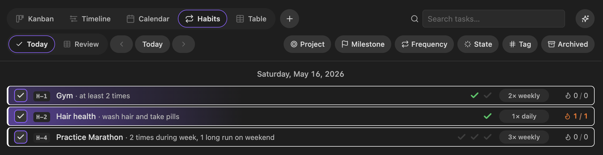
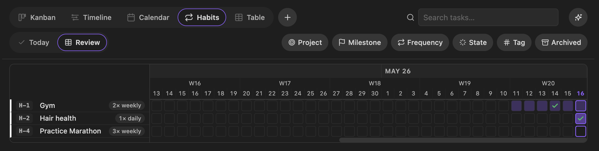

# Changelog

All notable changes to Marvis are documented in this file.

The format is based on [Keep a Changelog](https://keepachangelog.com/en/1.1.0/),
and this project adheres to [Semantic Versioning](https://semver.org/spec/v2.0.0.html).
Releases prior to 0.2.0 are not catalogued here — see the [GitHub releases page](https://github.com/Mahdi-Massahi/marvis/releases) for older notes.

## [Unreleased]

### Changed

- Calendar Week and Month chips (events, tasks, logs/habits) now fill with the project colour at the same low-opacity tint used in Day view, instead of only carrying a coloured border. Project membership is readable at a glance across all three calendar modes; chips without a project keep their plain background.

### Performance

- Indexer now coalesces vault and `metadataCache` events into a single 60ms flush. Bursty change streams (Apple Calendar sync, iCloud bursts, vault reload) previously triggered hundreds of cascading store updates and React re-renders; they now collapse to one. (`src/index/indexer.ts`)
- Habit views (Today, Review, Habit table, Habit card) no longer re-derive `Object.values(s.logs)` on every store mutation. The list selector returned a new array on every tick, defeating Zustand's identity check and causing every habit view to re-run `completionCounts` / `dayCounts` / `bonusTickDays` / `computeStreak` per habit. Subscribers now read the logs map directly and group logs by habit name once per render, collapsing the worst case from O(habits × logs) to O(logs + habits). (`src/views/Habits.tsx`, `src/views/shared/HabitCard.tsx`, `src/views/table/HabitTable.tsx`)
- Search filter caches the lowercased haystack per task and per habit in a `WeakMap` instead of rebuilding the (up-to-8000-char) body string on every keystroke. List-valued filter fields also pre-build their lookup `Set`s once per call. (`src/filter/filterEngine.ts`)
- Project lookup by name now goes through a memoised `Map<name, Project>` (`useProjectByName` in `src/views/context.ts`) instead of an `Object.values(projects).find(...)` per row in every chip, bar, and table row.
- Timeline `dayIndex` is now an arithmetic offset rather than a linear scan; for a 500-bar / 720-day chart this cuts ~1.5 M comparisons per render. (`src/views/Timeline.tsx`)
- Timeline now caches parsed RRules and the resulting occurrence arrays in a `WeakMap` keyed by the event reference + range, instead of re-parsing every recurring event over a ±2-year window on every filter change. (`src/utils/recurrence.ts`)
- `PlannerView` skips React re-renders when `layout-change` fires without an actual change in the assistant-leaf state. Tab focus, sidebar resize, and other layout events no longer rebuild the entire React tree. (`src/views/PlannerView.tsx`)

### Added

- Drag-to-reorder for habits in the Today view. Each row now exposes a grip handle on hover; dragging persists a fractional `order` to the habit's frontmatter so the new sequence carries across both Today and Review modes (and survives reloads). Uses the same dnd-kit + fractional-indexing pattern as Kanban cards.
- Status and priority rows in Settings now have up/down arrow buttons to reorder them. The Kanban view follows this order for its columns, so users who accidentally remove and re-add a status can move it back into place instead of being stuck with the new column at the end.

### Fixed

- Reordering a status or priority in Settings did not update the open Kanban view until the plugin was reloaded. The `columns` memo in `src/views/Kanban.tsx` depended on the whole `settings` object reference, which doesn't change when `settings.statuses` is replaced in-place; the memo now depends on `settings.statuses` and `settings.priorities` directly so reorders take effect immediately.

## [0.2.3] — 2026-05-16

### Fixed

- Calendar view opened on the 1st of the month regardless of the persisted mode, so reopening on Day or Week dropped the user on day 1 instead of today's slot. The initial cursor now mirrors the mode (today for Day/Week, first-of-month for Month), and switching between modes also snaps onto today's slot so each mode opens on a useful range.

## [0.2.2] — 2026-05-16

### Fixed

- Archived events were rendering in the Calendar and Timeline views. They now respect the existing `Include archived` filter toggle (same behaviour as archived tasks/habits) — hidden by default, visible when the toggle is on. `Event.archived` is parsed from frontmatter or an `/archive/` path segment, matching tasks.
- Recurring events with `BYDAY` were rendering one weekday too late for users in positive UTC offsets — e.g. a `FREQ=WEEKLY;BYDAY=TU,FR` event appeared on Wednesday/Saturday. `rrule.js` interprets `dtstart`'s UTC components, but `eventStartDate` constructs the anchor in local time, so local midnight Tuesday looks like Monday late-evening in UTC and the weekday resolution shifts forward. Switched the recurrence pipeline to floating-UTC dates: anchors and the query range are converted UTC-side-up before expansion, and occurrences are converted back to local Dates for display.

## [0.2.1] — 2026-05-16

### Fixed

- App becoming unresponsive to subsequent actions after a task property edit. The task action bar was calling `activeDocument.createDiv()` (which tries to append to the document root and throws `HierarchyRequestError: Only one element on document allowed`), aborting the Zustand store subscriber chain mid-tick and leaving the React tree out of sync until reload. Switched to the bare `createDiv()` / `createSpan()` / `createEl()` globals that return a detached element; same pattern fixed in `QuickCreateModal`.

## [0.2.0] — 2026-05-16

### Added

- **Habit tracker.** Daily, weekly, and monthly habits stored as markdown notes (`kind: habit`) under each project, with a configurable target count per period and optional goal/milestone link. Completions are normal logs with a `habit: [[…]]` backlink, so they index, search, and appear in Calendar/Table/Logs alongside everything else.
- **Today view** for habits — project-accented title, goal, cadence pill (e.g. `3× daily`), inline pip progress (target + gold-sparkle bonus slots), live streak chip, and a left-side check button as the primary tick action. A `[<] [date] [Today] [>]` day-bar with ←/→ keyboard nav lets you backfill yesterday or browse past days; streak math always reflects real "now."
- **Review view** for habits — two-pane heatmap with a fixed sidebar of habit rows and a horizontally-scrolling grid of the last N days (configurable in settings, default 60). Square cells, green for in-target ticks, gold-sparkle for bonus, intensity-shaded for partial periods. Strictly read-only.
- **Habits surface elsewhere** — Table view gains a Habits tab (editable target/state/project/frequency, bulk archive/delete); FilterBar exposes Frequency + State chip groups on the Habits view; Calendar renders habit logs with a repeat icon and gold backdrop; CreateMenuModal gets a Habit tab; palette commands for *Open habits*, *Create habit*, *Log habit completion*; new `H-N` stable codes.
- **AI assistant — habit visibility.** Two new read-only tools (`list_habits`, `get_habit_review`) returning the same shape Today and Review render. `get_planning_snapshot` extended with a `habits` block (active count, due-today list, on-streak list) so the model surfaces pending habits on open-ended planning prompts without a second tool call. The system instruction now mentions habits exist.

### Fixed

- **Delete command** generalised. The *Delete task* command and the file/editor-menu *Delete marvis task* items were gated on `kind === "task"`, so opening a habit log (or any non-task Marvis note) and triggering delete silently did nothing. The command is now *Delete note* and the menu items adapt their label per kind (`Delete marvis log`, `Delete marvis habit`, …) — they accept any Marvis kind and dispatch to the appropriate service.

### Changed

- Main view tabs reordered: Habits now sits between Calendar and Table.

[Unreleased]: https://github.com/Mahdi-Massahi/marvis/compare/0.2.0...HEAD
[0.2.0]: https://github.com/Mahdi-Massahi/marvis/compare/0.1.2...0.2.0
